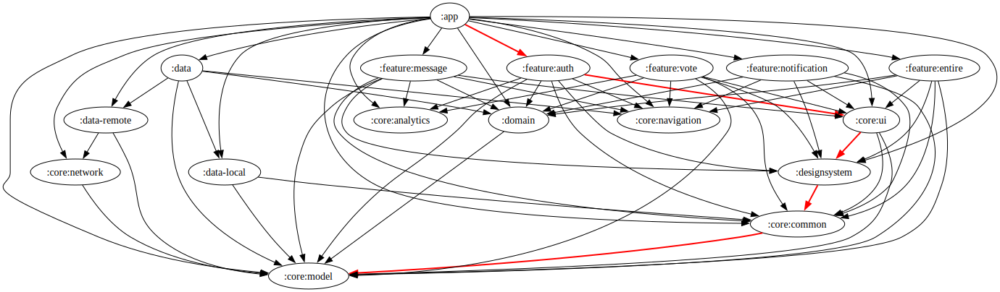

<p align="left">
  <a href="https://play.google.com/store/apps/details?id=com.bff.wespot.real">
    
  </a>
</p>


# ✨ WeSpot - 우리가 연결되는 공간 ✨

<p align="center"></p>

```
누군가 너를 좋아하고 있어!, 우리가 연결되는 공간 WeSpot

WeSpot은 투표와 쪽지의 두 가지 기능으로 구성된 10대의 소통 활성화를 위한 SNS 앱입니다.
```

</br></br>

## 💫 Contributors 💫
<table>
  <tr>
    <td align="center"><a href="http://github.com/jeongjaino"><br /><sub><b>JinHo Jeong</sub></a><br /><a href="https://github.com/YAPP-Github/24th-App-Team-1-Android/commits/main?author=jeongjaino" title="Code">💻</a></td>
    <td align="center"><a href="https://github.com/flash159483"><br /><sub><b>Jung Seungwon</b></sub></a><br /><a href="https://github.com/YAPP-Github/24th-App-Team-1-Android/commits/main?author=flash159483" title="Code">💻</a></td>
    <td align="center"><br /><sub><b>BFF BOT 1</b></sub><br /><sub><b>Made By JUCIY</b></b></sub></td>
    <td align="center"><br /><sub><b>BFF BOT 2</b></sub><br /><sub><b>Made By JUCIY</b></b></sub></td>
  </tr>
  <tr>
    <td align="center"><code>🍻제이콥🍻</td>
    <td align="center"><code>🍩브라우니🍩</td>
    <td align="center"><code>🥕짜치는 당근🥕</td>
    <td align="center"><code>🥕당근워크👟</td>
  </tr>
</table>

</br></br>

## 🌟 Tech Stack 🌟

| Kotlin | Kotlin 2.0.0v, Coroutines, Flow |
|:---|:---|
| Architecture | MVI(Orbit), MVVM, CleanArchitecture |
| Network | Ktor, Kotlin Serialization, Paging3 |
| Local | Protobuf DataStore, DataStorePreference |
| UI | Compose, ComposeDestination |
| Dependency Management | Gradle Convention Plugin(build-logic), VersionCatalogs |
| Dependency Injection | Dagger Hilt (KSP) |
| Lint | KtLint, DeteKt |
| Third Party | Material3, Lottie, Coil, Crashlytics, Analytics, CloudMessaging |
| Collaborate Tool | Github Action, Jira, Discord, Postman, Figma |

</br></br>

## ⭐ Dependency Graph ⭐

<p align="center"></p>
